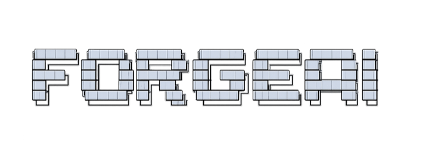

<div align="center">

<p align="center">
  
</p>

### A G E N T I C &nbsp;&nbsp; I N I T

`Task` → `Decompose` → `Score` → `Route` → `Agents` → `Review` → `✓`

**The AI workflow operating system for multi-agent coding teams**

[](https://www.npmjs.com/package/forgeai-agentic-init)
[](https://nodejs.org)
[](./LICENSE)
[](#profiles)

[Install](#install) · [Profiles](#profiles) · [Terminal UI](#terminal-ui) · [Model Routing](#model-routing) · [Checks](#basic-checks)

</div>

---

Install a shared AI workflow harness so every agent starts from the same rules,
memory, task workflow, model routing, review gates, and terminal monitor for
multi-agent orchestration — with built-in stack profiles for 11 ecosystems.

## Why Use It

- **Consistent agent context**: every agent starts from the same `.ai/` rules,
  project notes, workflow, and memory.
- **Multi-stack profiles**: ships with stack-specific guidance for Next.js,
  FastAPI, Django, Go, Rust, React Native, Tauri, Node API, Flutter/mobile, and
  more. Use `--profile auto` to detect your stack automatically, or combine
  profiles with `+` for polyglot projects.
- **Model-agnostic workflow**: works with Codex, Claude Code, AGY, Aider,
  local models, or any tool that can read markdown instructions.
- **Safer delegation**: includes task decomposition, session-scope checks,
  review gates, supply-chain checks, and fallback behavior when a model CLI is
  unavailable.
- **Terminal visibility**: `forgeai-init --watch` shows assignment progress,
  agents, checks, and activity logs in an Ink UI.
- **Plain files**: no server or database required; everything is markdown,
  JSON/YAML, and small local scripts.

## Requirements

- Node.js `>=20`
- npm / npx

ForgeAI does not install or authenticate model providers. If you want routed
delegation, install and authenticate the CLIs you configure, such as `codex`,
`agy`, `claude`, or another custom adapter.

## Install

For a new project, install the harness once:

```bash
npx forgeai-agentic-init@latest
```

Or install with stack detection:

```bash
npx forgeai-agentic-init@latest --profile auto
```

Preview files before writing if you want to inspect the install:

```bash
npx forgeai-agentic-init@latest --dry-run
```

After the harness is installed, agents that read `AGENTS.md` or `CLAUDE.md`
will run the ForgeAI preflight at the start of a session:

```bash
npx forgeai-agentic-init@latest --check-updates --check
```

If the installed harness is behind the latest package, the agent should ask
whether to skip for now or upgrade. If you approve the upgrade, the agent runs:

```bash
npx forgeai-agentic-init@latest --upgrade
```

### Upgrade commands

| Command | When to use |
|---------|-------------|
| `--check-updates` | Interactive local check. Queries npm for the latest version and offers an upgrade prompt. Skipped automatically in CI. |
| `--check-upgrade` | CI-safe offline check. Compares the harness version in `.ai/manifest.json` to the running CLI version. No network access. |

**CI example** — enforce a specific CLI version in your pipeline:

```bash
npx forgeai-agentic-init@3.4.0 --check-upgrade
```

Exits 0 when the installed harness matches the CLI version; exits 1 when
outdated (`harness < CLI`) or when the CLI is older than the installed harness
(`cli-too-old`). Does not check npm or the latest published version.

## CI/CD Integration

Copy the workflow template into your project:

```bash
mkdir -p .github/workflows
cp node_modules/forgeai-agentic-init/ci-templates/github/forgeai.yml \
   .github/workflows/forgeai.yml
```

Or download a pinned version directly from npm:

```bash
mkdir -p .github/workflows
curl -fsSL \
  https://unpkg.com/forgeai-agentic-init@3.7.0/ci-templates/github/forgeai.yml \
  -o .github/workflows/forgeai.yml
```

Then open `.github/workflows/forgeai.yml` and replace `VERSION` with your
current harness version (found in `.ai/manifest.json`).

The workflow runs five critical gates — **Harness version**, **Harness files**,
**Security**, **CodeGraph**, and **Review gates** — all without provider
credentials.

The template targets `branches: [main]`. If your repository uses `master`,
`develop`, or release branches, update the `on.push.branches` and
`on.pull_request.branches` lists before committing the workflow.

To make any job a required status check, go to **Settings → Branches →
Branch protection rules** and add the job name (e.g. `Harness version`,
`Security`).

## API Adapters

**New project:** `forgeai-init` creates `.ai/api-adapters.json` automatically
from the template.

**Existing project:** run `forgeai-init --upgrade` to add the file without
overwriting your customized config.

**Manual fallback** (only if the above does not apply):

```bash
cp node_modules/forgeai-agentic-init/templates/.ai/api-adapters.json \
   .ai/api-adapters.json
```

Set your API key in your shell or CI environment (never in project files):

```bash
export ANTHROPIC_API_KEY=sk-ant-...
export OPENAI_API_KEY=sk-...
export GOOGLE_API_KEY=AIza...
```

Route a compiled context artifact to an API adapter:

```bash
forgeai-init --route \
  --artifact .ai/state/context/TASK-01.json \
  --adapter anthropic
```

The adapter delivers the compiled context to the provider API and writes a
JSON run record to `.ai/state/runs/`. View records with:

```bash
forgeai-init --list-runs
```

**Quota fallback:** HTTP 429 responses fall back to a CLI adapter. Which one
is controlled by `fallback_adapter` in your API adapter config:

```json
{
  "adapters": {
    "anthropic": {
      "provider": "anthropic",
      "model": "claude-sonnet-4-6",
      "fallback_adapter": "claude"
    }
  }
}
```

If `fallback_adapter` is omitted, the router looks for a CLI adapter with the
**same name** as the API adapter (e.g. `"anthropic"`). The shipped template
sets `fallback_adapter` to the matching CLI adapter name for each provider.

**Timeout:** Default is 120 seconds (120 000 ms) per request, covering both
connection and body read. Override per adapter with `timeout_ms` (max 600 000):

```json
{ "provider": "anthropic", "model": "claude-sonnet-4-6", "timeout_ms": 60000 }
```

A timeout is classified as `network/retryable:true` — the same as a connection
error.

**Streaming output.** Add `--stream` to write model output to stdout
incrementally as it arrives (all three API providers):

```bash
forgeai-init --route --artifact .ai/state/context/TASK-01.json --adapter anthropic --stream
```

Without `--stream` the full response is buffered and written once. CLI adapters
ignore `--stream` — they already stream via inherited stdio. A failure that
occurs after streaming has begun cannot be retried or fall back (the bytes are
already on stdout); it exits 1.

**Retry with backoff.** Retryable failures (network, HTTP 5xx, HTTP 429) are
retried with exponential backoff before the quota→CLI fallback. Configure per
adapter with `max_retries` (0–5, default 2; `0` disables retry) and
`retry_base_ms` (default 500; backoff is `retry_base_ms * 2^attempt`):

```json
{ "provider": "anthropic", "model": "claude-sonnet-4-6", "max_retries": 3, "retry_base_ms": 500 }
```

Auth errors and mid-stream failures are never retried. `retry_count` is recorded
on each run record.

**Lifecycle events.** When the `--watch` TUI is running, routes emit
`run_start`, `retry_attempt`, and `run_complete` events (NDJSON) to its pipe,
shown in the activity log. Emission is best-effort — a missing or full pipe never
affects the route. `run_complete` describes the **API-adapter run only**: if the
adapter exhausts retries on quota, a `run_complete` with `outcome: quota` is
emitted *before* the CLI fallback runs, so it does not reflect the final route
outcome.

**Auth errors** (HTTP 401/403) fail immediately — no fallback. Check that the
correct env var is set.

**Run records are best-effort.** If `.ai/state/runs/` cannot be written the
route still completes; a warning is printed to stderr.

**Native API adapters return provider text to stdout.** They do not directly
edit files or execute tools; downstream automation must apply or consume the
response. This differs from CLI adapters (Claude Code, Codex) which run
interactive agents with filesystem access.

## Profiles

ForgeAI ships with **11 stack-specific profiles**. Each profile installs
additional guidance documents, workflow templates, and skills tuned to that
stack's tooling, test patterns, and common conventions — on top of the shared
base harness.

**Zero-config detection** — let ForgeAI read your project files and pick the
right profile:

```bash
npx forgeai-agentic-init@latest --profile auto
```

**Pick a profile by name** with `--profile <name>`:

| Profile | Stack | Auto-detected from |
|---------|-------|--------------------|
| `nextjs` | Next.js (React SSR/SSG) | `next` in `package.json` |
| `node-api` | Node.js REST / GraphQL API | `express`, `fastify`, `@nestjs/core`, `hono`, `koa` |
| `python-api` | Generic Python web service | Python project files (fallback) |
| `fastapi` | FastAPI (Python async API) | `fastapi` in Python dependency files |
| `django` | Django (Python full-stack) | `django` in Python dependency files |
| `go` | Go service or CLI | `go.mod` |
| `rust` | Rust binary or library | `Cargo.toml` |
| `mobile` | Flutter / native iOS & Android | `pubspec.yaml`, `ios/`, `android/` |
| `react-native` | React Native / Expo | `react-native` or `expo` in `package.json` |
| `tauri` | Tauri desktop app | `src-tauri/`, `tauri.conf.json` |
| `monorepo` | Monorepo workspace | `pnpm-workspace.yaml`, `turbo.json`, `nx.json`, `lerna.json`, `workspaces` |

**Polyglot and monorepo projects** — combine any profiles with `+`:

```bash
# Next.js inside a monorepo
npx forgeai-agentic-init@latest --profile nextjs+monorepo

# FastAPI backend + Go sidecar
npx forgeai-agentic-init@latest --profile fastapi+go

# Tauri app with a React Native companion
npx forgeai-agentic-init@latest --profile tauri+react-native
```

List all available profiles at any time:

```bash
npx forgeai-agentic-init@latest --list-profiles
```

Validate that the installed profile matches detected project signals:

```bash
npx forgeai-agentic-init@latest --check-profile
```

## What Gets Installed

```text
AGENTS.md
CLAUDE.md
.ai/
  PROJECT.md
  RULES.md
  MEMORY.md
  WORKFLOW.md
  AGENT_REGISTRY.md
  MODEL_ROUTING.md
  model-routing.yaml
  cli-adapters.json
  router/run-model.ts
  agents/
  skills/
  workflows/
  state/
  codegraph/
  evaluation/
.claude/
openspec/
```

These files tell agents how to understand the project, split work, route
subtasks, validate changes, review delegated output, and hand work back to a
human.

## Basic Checks

Run a lightweight harness check:

```bash
npx forgeai-agentic-init@latest --check
```

Run the full local gate:

```bash
npx forgeai-agentic-init@latest --check-all
```

Useful focused checks:

```bash
npx forgeai-agentic-init@latest --check-sessions
npx forgeai-agentic-init@latest --check-codegraph --strict
npx forgeai-agentic-init@latest --check-review
npx forgeai-agentic-init@latest --check-security
```

## Terminal UI

Start the Ink monitor in one terminal:

```bash
forgeai-init --watch
```

When the orchestrator routes assignments through `.ai/router/run-model.ts`, the
UI updates automatically.

```text
╭────────────────────────────────────────────────────────╮
│ ForgeAI Orchestration Monitor              ● LIVE 10:42 │
├────────────────────────────────────────────────────────┤
│ TASK                                                   │
│ Build terminal workflow monitor                        │
├──────────────────────────────┬─────────────────────────┤
│ AGENTS                       │ ACTIVITY LOG            │
│ ⟳ orchestrator [lead]        │ assigned codex-1        │
│ ✓ codex-1 [backend]          │ codex-1 success         │
│ ⟳ reviewer-1 [reviewer]      │ security check pass     │
├──────────────────────────────┴─────────────────────────┤
│ CHECKS  ✓ security   ⟳ codegraph   ○ approval          │
╰────────────────────────────────────────────────────────╯
```

You can also emit a manual event:

```bash
forgeai-init --emit '{"type":"orchestrator.start","task":"Build auth flow","ts":1720000000}'
```

### Compact Delegation Context

For large tasks, generate a bounded assignment plan and graph-guided context
pack before routing work to another model:

```bash
forgeai-init --decompose --compact --objective "refactor router fallback"
forgeai-init --refresh-codegraph
forgeai-init --context-pack --objective "refactor router fallback"
```

The refresh command parses local TypeScript and JavaScript imports, exports,
literal dynamic imports, and CommonJS `require` calls. The context pack starts
from objective-matched paths, exported symbols, or curated CodeGraph metadata,
then follows recorded dependencies and dependents. Every selected file includes
a graph-path explanation.

`--context-pack` refuses a missing, invalid, or stale dependency graph. It does
not silently rewrite project state; refresh explicitly after source files
change. Traversal defaults to depth 2 and 12 files and can be bounded further:

```bash
forgeai-init --context-pack \
  --objective "refactor router fallback" \
  --max-depth 1 \
  --max-nodes 8
```

Compile the selected files into syntax-aware excerpts before sending context to
a model:

```bash
forgeai-init --compile-context \
  --objective "refactor router fallback" \
  --budget 6000 \
  --output .ai/state/context/router-fallback.json
```

The JSON file is the deterministic source of truth. ForgeAI also writes a
Markdown rendering beside it for human inspection. Functions, classes,
interfaces, types, imports, and directly related tests retain source-line
provenance. Complete syntax nodes are included when they fit; oversized
functions and classes fall back to signatures instead of being truncated in
the middle. Mandatory and task-applicable sections from `.ai/RULES.md`, compact
git status/diff evidence, and available validation scripts are packed into the
same artifact, so a consumer does not need to reopen the full rules file.

The budget estimate is deterministic (`characters / 4`) and applies
to the serialized JSON artifact, not to the optional Markdown rendering or a
provider's exact tokenizer.

Use the resulting read scope, write scope, and validation plan as the
delegated assignment boundary. This controls scope and keeps delegation
consistent; it does not by itself guarantee lower token usage. Record token
cost, model calls, files read, and latency in `.ai/evaluation/<run-id>.md` so
future routing decisions can be based on measured evidence rather than
assumptions. Exact provider token savings remain an evaluation claim, not a
guarantee of the compiler's deterministic estimate.

## Context Enforcement

After compiling context with `--compile-context`, Phase 11 commands enforce
it as the verified input for delegated model calls.

### Validate an artifact

```bash
forgeai-init --validate-artifact --artifact .ai/state/context/TASK-01.json
```

Checks schema, fingerprint freshness, path membership, and token estimate
consistency. Exits 0 on success; exits 1 with a descriptive error on failure.

### Route to a CLI adapter

```bash
forgeai-init --route \
  --artifact .ai/state/context/TASK-01.json \
  --adapter claude \
  --model claude-sonnet-4-6
```

Validates the artifact, then pipes the JSON to the named adapter's stdin.
Without `--adapter`, writes validated JSON to stdout for manual piping.
Records each routing attempt in `.ai/state/context-routes.md`.

### Request additional context

When a delegated model needs more context, it writes a `forgeai_need_context`
JSON file:

```json
{
  "kind": "forgeai_need_context",
  "schema_version": 1,
  "artifact": ".ai/state/context/TASK-01.json",
  "requests": [
    { "kind": "file", "path": "src/auth/internal.ts", "reason": "need private helper" }
  ]
}
```

The orchestrator runs:

```bash
forgeai-init --expand-context \
  --artifact .ai/state/context/TASK-01.json \
  --need-context .ai/state/context/TASK-01-need-context.json \
  --output .ai/state/context/TASK-01-expansion-1.json
```

The supplemental artifact contains only the additionally requested context,
deduplicated against the primary artifact.

## RTK Integration

[RTK (Read Tool Kit)](https://github.com/nahco314/rtk) is an optional tool
that wraps noisy shell commands so large output is filtered before it reaches
model context. ForgeAI's agent templates treat it as the preferred path for
high-output operations.

### When to use each RTK command

| Command | Use when |
| --- | --- |
| `rtk git status` | Checking working tree state before committing or delegating |
| `rtk git diff` | Reviewing unstaged or staged changes — output can be very large |
| `rtk grep "pattern" .` | Searching the codebase for symbols, strings, or patterns |
| `rtk read path/to/file` | Reading a file whose content may exceed useful context size |
| `rtk test <cmd>` | Running tests or validation where output is expected to be large |

### Fallback: built-in compact diagnostics

If RTK is not installed, ForgeAI's CLI provides structured Markdown
equivalents that agents can use directly:

```bash
forgeai-init --status-summary   # branch, staged/unstaged/untracked counts, file list
forgeai-init --diff-summary     # changed files table, exact insertions/deletions
forgeai-init --test-summary     # auto-detects typecheck/lint/test/build, reports pass/fail
```

These flags are also useful for scripting and CI pipelines where RTK is not
available. Both RTK and the built-in flags help control diagnostic scope and
present consistent evidence to agents. They do not guarantee lower total token
usage for a completed task.

The template guidance in `.ai/RULES.md` and `.ai/WORKFLOW.md` explains when
each command is required during implementation and validation.

## Model Routing

ForgeAI ships with routing policy in:

```text
.ai/model-routing.yaml
.ai/cli-adapters.json
.ai/router/run-model.ts
```

The router can run a delegated assignment:

```bash
npx tsx .ai/router/run-model.ts \
  --tier standard \
  --assignment .ai/state/assignments/TASK-01.md
```

Register a custom provider CLI:

```bash
forgeai-init --add-model glm --model glm-4.6 --tier standard
```

### Important Routing Note

Model routing is a harness and router, not a magic controller. The active
orchestrator still needs to be prompted to use the ForgeAI workflow.

When using multiple routers or multiple model CLIs, give the orchestrator an
explicit instruction like:

```text
Use the ForgeAI workflow in this repo. Read AGENTS.md, then decompose the task,
score subtasks with .ai/model-routing.yaml, create bounded assignments, and
route delegated work through .ai/router/run-model.ts when useful. If a routed
model is unavailable, complete the bounded assignment locally and report the
fallback.
```

Without that instruction, many agent tools will read the code and solve the
task directly instead of invoking the router.

## Recommended Workflow

1. Install the harness with `npx forgeai-agentic-init@latest`.
2. Ask the agent to read `AGENTS.md` or `CLAUDE.md`.
3. For larger work, ask it to decompose and route subtasks.
4. Run `forgeai-init --watch` if you want terminal visibility.
5. Run `forgeai-init --check-all` before review or release.

## License

MIT
